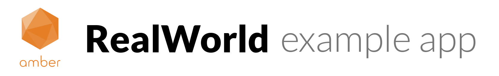

# 

[](Your project url)

> ### Amber Framework codebase containing real world examples (CRUD, auth, advanced patterns, etc) that adheres to the [RealWorld](https://github.com/gothinkster/realworld) spec and API.

### [Demo](https://github.com/gothinkster/realworld)&nbsp;&nbsp;&nbsp;&nbsp;[RealWorld](https://github.com/gothinkster/realworld)


This codebase was created to demonstrate a fully fledged fullstack application built with **Amber Framework** including CRUD operations, authentication, routing, pagination, and more.

We've gone to great lengths to adhere to the **Amber Framework** community styleguides & best practices.

For more information on how to this works with other frontends/backends, head over to the [RealWorld](https://github.com/gothinkster/realworld) repo.


# How it works

> Describe the general architecture of your app here

# Getting started

## Install Crystal

Read official [installation documentation](https://crystal-lang.org/docs/installation/)

## Install Amber Framework

Read official [installation documentation](https://amberframework.org/guides/getting-started/Installation/README.md#installation)

## Install Project

```bash
git clone https://github.com/ChangJoo-Park/amber-realworld-example-app
cd amber-realworld-example-app
shards install # install dependencies
amber db drop create migrate seed # initialize, migrate databases
amber w # run dev server
```
